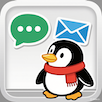
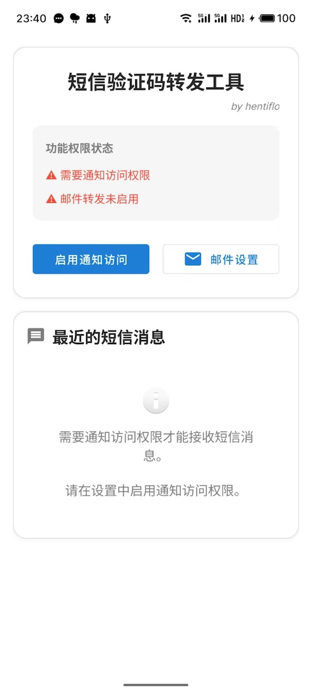
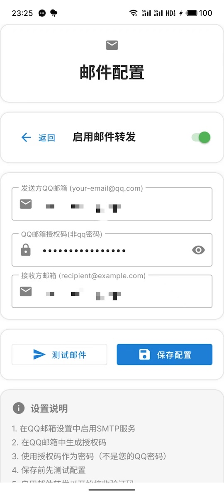
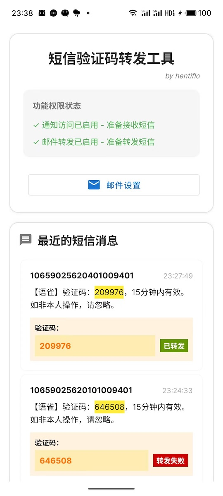
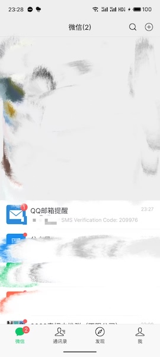

# SMSForward - SMS 验证码转发器

一个兼容 Android 6.0+ 的 SMS 验证码自动转发应用，通过通知拦截技术将短信验证码自动转发到指定邮箱或Server酱。

## 📱 应用信息

- **应用名称**: SMSForward
- **包名**: com.cht.smsforward
- **目标 SDK**: 36 (Android 15)
- **最低 SDK**: 23 (Android 6.0)

## 🚀 主要功能

### 核心功能
- **SMS 验证码自动转发**: 自动识别并转发短信中的验证码到指定邮箱或Server酱
- **通知拦截技术**: 使用 NotificationListenerService 拦截短信通知（兼容 Android 6.0+ 设备，特别优化 Meizu 设备）
- **双重转发支持**: 同时支持邮件和Server酱两种转发方式，可独立启用或同时使用
- **邮件发送配置**: 支持 QQ 邮箱 SMTP 配置，安全存储邮箱凭据
- **Server酱推送**: 支持Server酱微信推送，即时接收验证码通知
- **权限管理界面**: 统一的权限状态显示和管理

### 技术特性
- **加密存储**: 使用 EncryptedSharedPreferences 安全存储邮箱和Server酱配置
- **网络诊断**: 内置网络连接诊断功能，支持邮件服务器连通性检测
- **多协议支持**: 支持 TLS/SSL 邮件发送协议和 HTTPS Server酱推送
- **实时状态**: 实时显示通知访问、邮件转发和Server酱推送状态
- **统一架构**: 基于统一的配置管理和消息发送框架，易于扩展

## 📦 安装说明

### 系统要求
- Android 6.0 (API 23) 或更高版本
- 网络连接权限
- 通知访问权限

### 安装步骤
1. 从 [Releases](https://github.com/cht123456abc/SMSForward3/releases) 页面下载最新的 APK 文件
2. 在 Android 设置中启用"未知来源安装"
3. 安装下载的 APK 文件
4. 启动应用并按照设置向导配置权限

## ⚙️ 配置说明

### 1. 启用通知访问权限
- 打开应用后点击"Enable Notification Access"
- 在系统设置中找到"SMSForward"并启用通知访问权限
- 返回应用确认权限状态

### 2. 配置转发方式

#### 邮箱转发配置
- 点击"Email Settings"进入邮箱配置页面
- 填写以下信息：
  - **发送方邮箱**: 您的 QQ 邮箱地址
  - **授权码**: QQ 邮箱的 SMTP 授权码（非 QQ 密码）
  - **接收方邮箱**: 接收验证码的邮箱地址

#### Server酱推送配置
- 点击"Server酱 Settings"进入Server酱配置页面
- 填写以下信息：
  - **SendKey**: 从Server酱官网获取的推送密钥

### 3. QQ 邮箱 SMTP 设置
1. 登录 QQ 邮箱网页版
2. 进入"设置" → "账户"
3. 开启"SMTP服务"
4. 生成授权码（用于应用中的密码字段）
5. 在应用中使用授权码而非 QQ 密码

### 4. Server酱设置
1. 访问 [Server酱官网](https://sct.ftqq.com/)
2. 使用微信扫码登录
3. 进入"SendKey"页面
4. 复制您的SendKey
5. 在应用中粘贴SendKey并保存
6. 使用"Test Message"功能测试推送是否正常

## ✨ 转发方式对比

| 特性 | 邮件转发 | Server酱推送 |
|------|----------|-------------|
| **实时性** | 较快（2~5s） | 极快（1s） |
| **配置复杂度** | 简单（需要邮箱授权码） | 简单（仅需SendKey） |
| **依赖服务** | QQ邮箱SMTP | Server酱微信服务 |
| **网络要求** | SMTP端口（587/465） | HTTPS（443） |
| **适用场景** | 需要邮件记录存档 | 需要即时手机通知 |

## 📱 应用截图





## 🔧 使用方法

1. **完成初始配置**后，应用将自动在后台运行
2. **接收短信**时，应用会自动检测验证码
3. **自动转发**检测到的验证码到配置的邮箱和/或Server酱
4. **查看历史**：在主界面可以查看最近接收的短信记录和转发状态
5. **复制验证码**：点击验证码可以快速复制到剪贴板
6. **灵活配置**：可以单独启用邮件转发、Server酱推送，或同时启用两种方式

## 🛠️ 技术架构

### 核心组件
- **MainActivity**: 主界面，显示权限状态和短信历史
- **BaseConfigActivity**: 统一的配置界面基类
- **EmailConfigActivity**: 邮箱配置界面，支持网络诊断
- **ServerChanConfigActivity**: Server酱配置界面
- **SmsNotificationListener**: 通知监听服务，拦截短信通知
- **MessageSender**: 统一的消息发送框架
- **EmailSender**: 邮件发送组件，支持多种 SMTP 配置
- **ServerChanSender**: Server酱推送组件

### 技术栈
- **开发语言**: Java
- **UI 框架**: Android Views + Material Design
- **数据存储**: EncryptedSharedPreferences
- **邮件发送**: JavaMail API
- **HTTP 推送**: 原生 Android 网络 API
- **架构模式**: 统一配置管理 + 泛型消息发送框架

## 🔒 隐私与安全

- **本地存储**: 所有邮箱和Server酱配置信息均加密存储在本地
- **无云服务**: 应用不使用任何云服务，数据不会上传到服务器（Server酱除外）
- **权限最小化**: 仅请求必要的权限（通知访问、网络访问）
- **开源透明**: 完整源代码开放，可自行审查安全性
- **可选推送**: Server酱推送完全可选，可以仅使用邮件转发功能

## 🐛 故障排除

### 常见问题

**Q: 收不到验证码转发邮件或Server酱推送？**
A: 请检查：
- 通知访问权限是否已启用
- 相应的转发方式是否已启用
- 邮箱配置是否正确（特别是授权码）
- Server酱 SendKey 是否正确
- 网络连接是否正常
- 垃圾邮件文件夹（邮件转发）

**Q: 邮件发送失败？**
A: 请尝试：
- 确认 QQ 邮箱 SMTP 服务已开启
- 检查授权码是否正确
- 使用应用内的"Test Email"功能测试配置
- 检查网络连接和防火墙设置
- 使用网络诊断功能检查连通性

**Q: Server酱推送失败？**
A: 请尝试：
- 确认 SendKey 是否正确
- 检查网络连接是否正常
- 使用应用内的"Test Message"功能测试配置
- 确认Server酱服务状态是否正常

**Q: 在某些设备上无法正常工作？**
A: 本应用使用通知拦截技术而非传统 SMS API，兼容 Android 6.0+ 设备，特别针对 Meizu 等设备进行了优化。如遇问题请确保已正确授予通知访问权限。

## 📄 开源协议

本项目采用 [MIT License](LICENSE) 开源协议。

## 🤝 贡献

欢迎提交 Issue 和 Pull Request！

### 开发环境
- Android Studio 2024.1+
- JDK 17+
- Android SDK 23+

### 构建说明
```bash
git clone https://github.com/cht123456abc/SMSForward3.git
cd SMSForward3
./gradlew assembleRelease
```

## 📞 支持

如遇问题，请在 [GitHub Issues](https://github.com/cht123456abc/SMSForward3/issues) 页面报告。

## 📋 更新日志

### v1.1.0 (最新版本)
- ✅ 新增 Server酱 微信推送支持
- ✅ 重构统一配置管理架构
- ✅ 优化用户界面和交互体验
- ✅ 增强网络诊断功能
- ✅ 支持双重转发（邮件+Server酱）
- ✅ 改进包结构和代码组织

### v1.0.0
- ✅ 基础SMS验证码转发功能
- ✅ 邮件SMTP转发支持
- ✅ 通知拦截技术实现
- ✅ 加密配置存储

---

**注意**:
- 本应用仅用于个人验证码转发用途，请遵守相关法律法规和服务条款
- Server酱是第三方服务，使用前请了解其服务条款和隐私政策
- 建议根据个人需求选择合适的转发方式，或同时启用多种方式以提高可靠性
